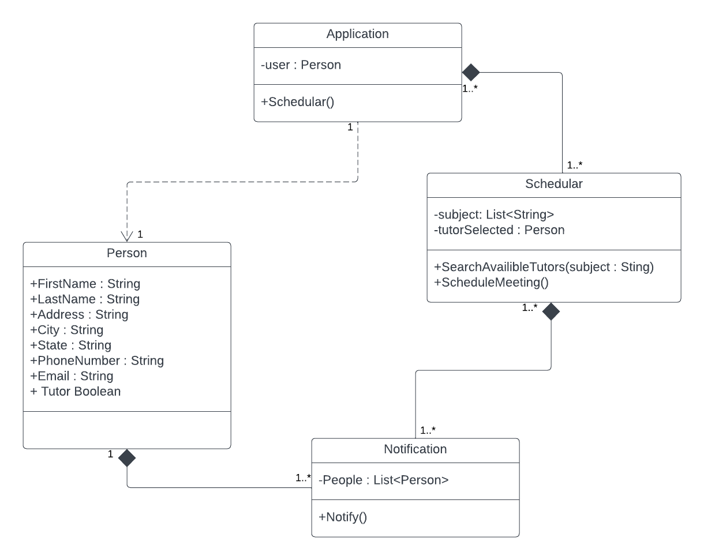

# CIS_350_Group_Project
___
## TutorFinder
## Made By: Anthony Chouinard and Ryan Landgren

___

### 1. Abstract
Classes are hard for many students. Many students may struggle with coursework, and this can affect their grade and possibly their future. This may require students to acquire extra help, and this help may come through fellow classmates, teachers, or tutors. Essentially, there is a need for tutors, and these tutors may be hard to find, and it may be even harder to find one that is experienced in exactly what the student is looking for. Our idea for our Tutor Finder application is to connect students with someone who can help them with their curriculum needs. The purpose is to give students a way to find tutors in their area that meet their requirements for help. The students and tutors will be able to communicate and determine meeting times that will be able to accommodate both the tutor's schedule and the student's schedule.
___
### 2. Introduction
With the number of college undergraduate students increasing yearly, the demand for education increases with it. Many students study every year especially new, incoming freshmen, and it can be hard for these new students to find help. The benefits of mobile devices can be used to help connect students with another, and this can be used to support them in their struggles with their classes. Our app, TutorFinder, has one goal, and it is to connect students with others nearby to find help with classes and subjects they are currently struggling with. The app is on mobile devices as nearly everybody has a cellphone on their person at most times of the day, and they are more readily available than computers accessing a website. TutorFinder can be used to filter out help through different subjects, different times, and different locations.
___
### 3. Architectural Design
___
#### 3.1 Class Diagram

___
#### 3.2 Sequence Diagram

___
