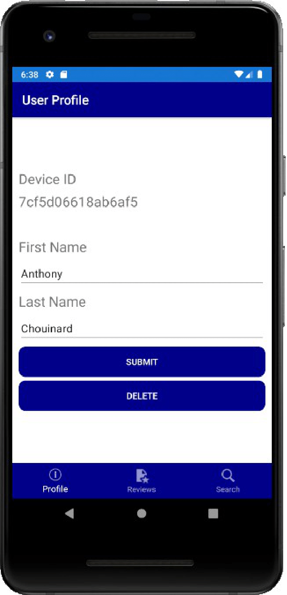
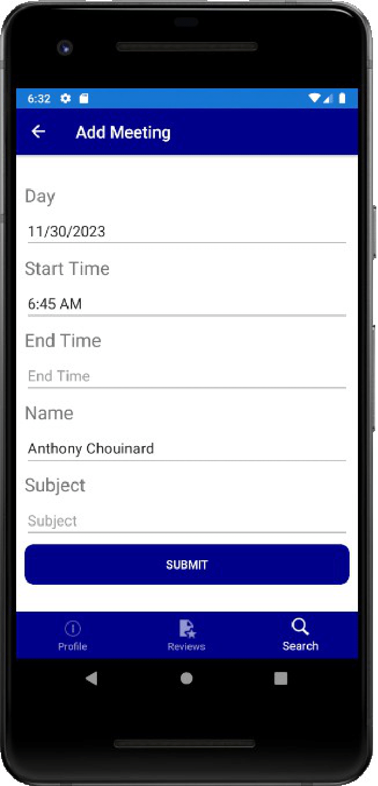
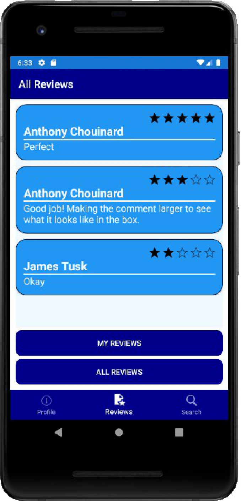
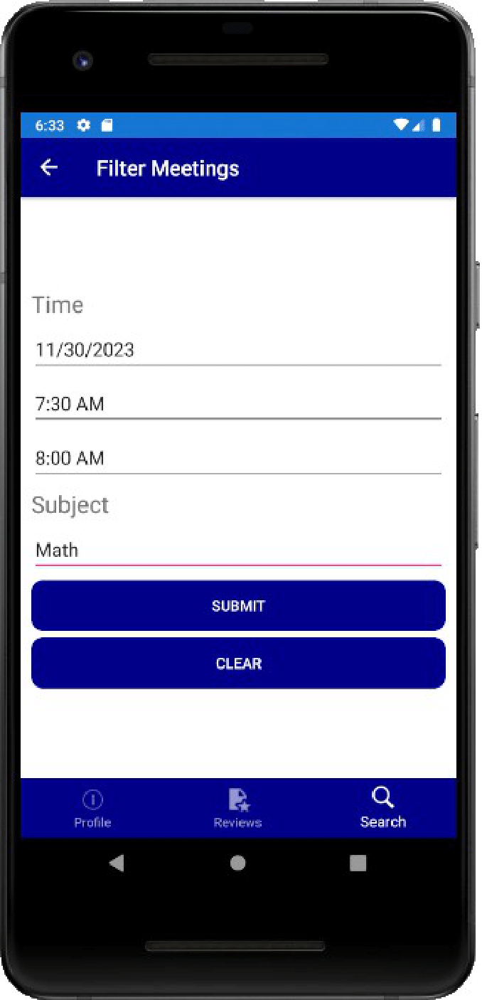

# CIS_350_Group_Project
___
## TutorFinder
## Made By: 
___
### Anthony Chouinard
### Ryan Landgren

___

### 1. Abstract
Classes are hard for many students. Many students may struggle with coursework, and this can affect their grade and possibly their future. This may require students to acquire extra help, and this help may come through fellow classmates, teachers, or tutors. Essentially, there is a need for tutors, and these tutors may be hard to find, and it may be even harder to find one that is experienced in exactly what the student is looking for. Our idea for our Tutor Finder application is to connect students with someone who can help them with their curriculum needs. The purpose is to give students a way to find tutors in their area that meet their requirements for help. The students and tutors will be able to communicate and determine meeting times that will be able to accommodate both the tutor's schedule and the student's schedule.
___
### 2. Introduction
With the number of college undergraduate students increasing yearly, the demand for education increases with it. Many students study every year especially new, incoming freshmen, and it can be hard for these new students to find help. The benefits of mobile devices can be used to help connect students with another, and this can be used to support them in their struggles with their classes. Our app, TutorFinder, has one goal, and it is to connect students with others nearby to find help with classes and subjects they are currently struggling with. The app is on mobile devices as nearly everybody has a cellphone on their person at most times of the day, and they are more readily available than computers accessing a website. TutorFinder can be used to filter out help through different subjects, different times, and different locations.
___
### 3. Architectural Design
___
Our TutorFinder app is based off the client-server architecture. Our users must install the app onto an Android Platform as it is built upon an Android User Interface. The user will receive information from our Firebase Database about other users. This information includes whether or not they are a tutor or a student. The database stores the users' primary subject, available times, their ratings based on reviews from other users, and the users' name.
#### 3.1 Class Diagram

___
#### 3.2 Sequence Diagram

___
### 4. User Guide / Implementation
___
#### 4.1 Client Side
___
##### 4.1.1 Starting the App
The user will install the Tutor Finder app onto an Android platform. Once installed, the user will have the TutorFinder app icon appear onto their home screen. Upon start up, the user will be greeted with different tabs of which all do different functions for the user. One tab searches amongst a list of available tutors. Another tab will show the current users profile, this tab will hold their name and unique device ID. The third tab will be a reviews tab. This tab displays reviews of different tutors.

  

___

##### 4.1.2 Registration
The registration for the app is based on a unique I.D. the user is assigned to their current device. The I.D. will hold the user's profile information including their name, average rating, and primary subject. This information will then be saved to the database we have setup in Firebase.

___

##### 4.1.3 Login
The login will take the user's unique I.D. number as well as their first name and their last name in order to login. The profile information will always be saved to the unique device ID. The ID is used to ensure the users' information are stored seperately in our database.

___

#### 4.2 Home

From here, the user can decide to search for tutors based on times available and their primary subject.

___

##### 4.2.1 Meeting Details
Upon login, the user will have the ability to schedule meetings based on what is available that day. They can narrow the selection of meetings based on a filter system which will filter out different meeting times, meeting days, and the subject of the meeting.

___

##### 4.2.2 Scheduling a Meeting
Once the user decides which meeting they would like, they must select the meeting. Upon their selection, the app will communicate with the database, and it will tell the database that the meeting is no longer open; therefore, it will become unavailable for future selection.

___

##### 4.2.3 Leaving a Rating
After a meeting, the user will have the ability to leave comments and ratings about the tutor they met with. These comments and ratings will be saved to that tutor's profile, and they will be readily available for the public to see. The ratings are based off a 5 star measurement, and they can increase or decrease by 0.5 stars.

___

#### 4.3 Server Side
The server service we are using is Firebase. Our firebase database will hold all the information of registered users. The database holds values for different names, the IDs of the different users, the users' primary subject, and the users' ratings and reviews will be contained by the database as well.
___

### 5. Future Scope
In the future, some goals for this app would be able to associate different tutors and students with specific schools. For example, we would be able to add other attributes to the users' profiles that will allow them to add which school they are apart of. Further down the line, a goal could be to add specific classes the tutors are experienced in, i.e CIS350, WRT350, EGR112.

Other possibilites we had discussed in the early development stage was adding a Direct Messaging system. The idea would be for this system to work similarly to that of Facebook, Instagram, and other social media apps. A user would be able to reach out to another to communicate information associated with meetings and other information associated with tutoring.
___

### 6. Conclusion
The goal for our app is to help students be able to succeed. Pursuing help for a difficult class can be a hard thing because students may find it hard to become part of a study group. This app can help eliminate the difficulties of finding help by creating specific, agreed to, meeting times. The students will be able to take the information on the tutors given by the app, and then the students will be able to determine if that tutor is a correct fit.
___

### 7. Walkthrough Video

https://youtu.be/XN-t9BI7UAg
